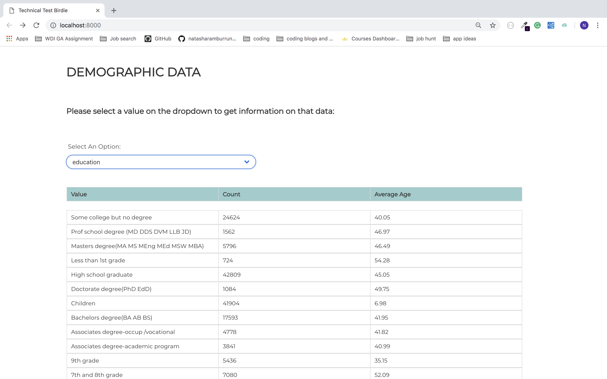

## Technical test Birdie

### Key requirements:
- SPA Small Single page application that visualizes database data
- Application should allow to select a column (amongst demographic data), then display, for each different value in this column, number of lines with this value, and "age" value average.
- Values must be sorted by decreasing order
- One can display only 100 first values.

#### Technologies Used:
HTML | SCSS | JavaScript (ES6) | React | Nodejs | mySQL | Webpack | Bulma | Sass

#### Build:

- Built an application where the user can select an option on a dropdown box which triggers an onChange handler
- Set up backend to obtain data from mySQL database
- Request that the getResult method sends a AXIOS GET request calling the API
- Set up frontend using React requesting RES.JSON response and setState
- Update UI rendering query results

#### Wins:

- Built an application which renders values taken from the database

#### Challenges:

- I experience a couple of Challenges, firstly it take a very long time for the data to load when change options in the drop down box, I decided to include a loading page to avoid the user to continue to select items while loading.
- I did not complete the indication of number of non-displayed values ie lines.

<strong>Single Page Application</strong>:

